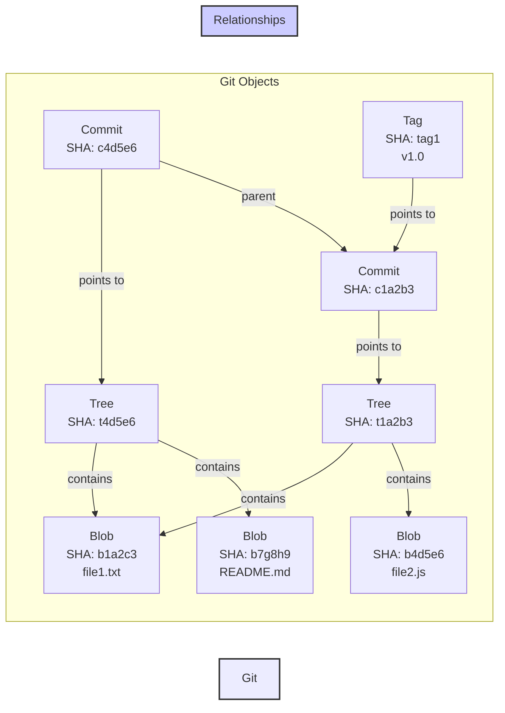

### Các đối tượng (thành phần) của Git

- Trong **Git** thư mục `.git/objects/` là nơi lưu trữ tất cả các đối tượng (**objects**) như **blob**, **tree**, **commit**, và **tag**. Mỗi đối tượng này được nhận dạng duy nhất bằng một mã băm **SHA-1** dài **40 ký tự**. [Xem chi tiết](topics/git-objects.md).

- Git `Blob` (viết tắt của “Binary Large Object”) là một loại đối tượng cơ bản được sử dụng để lưu trữ `nội dung của tệp`. [Xem chi tiết](topics/git-blob.md).
- Git **Tree** là đại diện cho cấu trúc thư mục tại một thời điểm cụ thể. [Xem chi tiết](topics/git-tree.md).

### Sử dụng Git trong công việc (workflow)

- Trong quá trình phát triển dự án, có những lúc bạn đang làm việc trên một tính năng mới nhưng cần chuyển đổi sang một nhánh khác hoặc cập nhật mã nguồn từ xa. Tuy nhiên, các thay đổi hiện tại của bạn chưa sẵn sàng để commit. Hãy sử dụng [`git stash`](topics/git-stash.md).

- **Git Workflow** được sử dụng để tối ưu hóa hợp tác, giảm xung đột code và đảm bảo chất lượng sản phẩm. [Xem chi tiết](topics/git-workflow.md).
