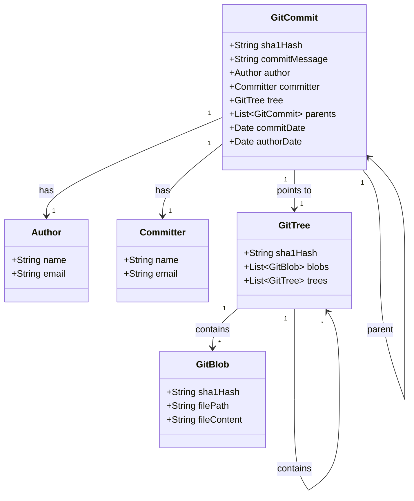

### Git commit

- **Git Commit** là một khái niệm cơ bản và quan trọng trong hệ thống quản lý phiên bản Git. Nó đại diện cho một điểm mốc (snapshot) trong lịch sử phát triển của dự án, ghi lại trạng thái của toàn bộ mã nguồn tại một thời điểm cụ thể. Mỗi khi bạn thực hiện một commit, Git sẽ lưu trữ các thay đổi bạn đã thực hiện kể từ commit trước đó, tạo thành một chuỗi các commit liên kết với nhau.

### Các thành phần của Git Commit

- **SHA-1 Hash**:
  - Mỗi commit được xác định duy nhất bởi một mã băm SHA-1, đảm bảo tính toàn vẹn và không thể thay đổi của dữ liệu.

- **Thông Điệp Commit (Commit Message)**: Một mô tả ngắn gọn và rõ ràng về những thay đổi đã được thực hiện. Thông điệp này giúp người khác (và chính bạn trong tương lai) hiểu được mục đích của commit.

- **Author và Committer**
  - Author: Người tạo ra các thay đổi.
  - Committer: Người thực hiện commit (có thể khác với author nếu commit được thực hiện bởi người khác, ví dụ như trong quá trình merge).

- **Parent Commit(s)**
  - Liên kết đến commit trước đó. Đối với commit thông thường, chỉ có một parent. Đối với commit merge, có thể có nhiều parent.

- **Tree**
  - Đại diện cho cấu trúc thư mục và các tệp tại thời điểm commit. Nó chứa thông tin về các đối tượng Blob (dữ liệu tệp) và Tree (thư mục con).

### Vai Trò của Git Commit trong Quản Lý Phiên Bản

- **Theo Dõi Lịch Sử:**
  - Mỗi commit ghi lại trạng thái của dự án tại một thời điểm cụ thể, cho phép bạn theo dõi và quay lại các phiên bản trước nếu cần thiết.

- **Hợp Tác:**
  - Khi làm việc trong nhóm, các commit giúp mọi người hiểu được những thay đổi mà từng thành viên đã thực hiện.

- **Quản Lý Tính Năng và Sửa Lỗi:**
  - Sử dụng các nhánh (branches) và commit, bạn có thể phát triển tính năng mới hoặc sửa lỗi mà không ảnh hưởng đến mã nguồn chính.
  