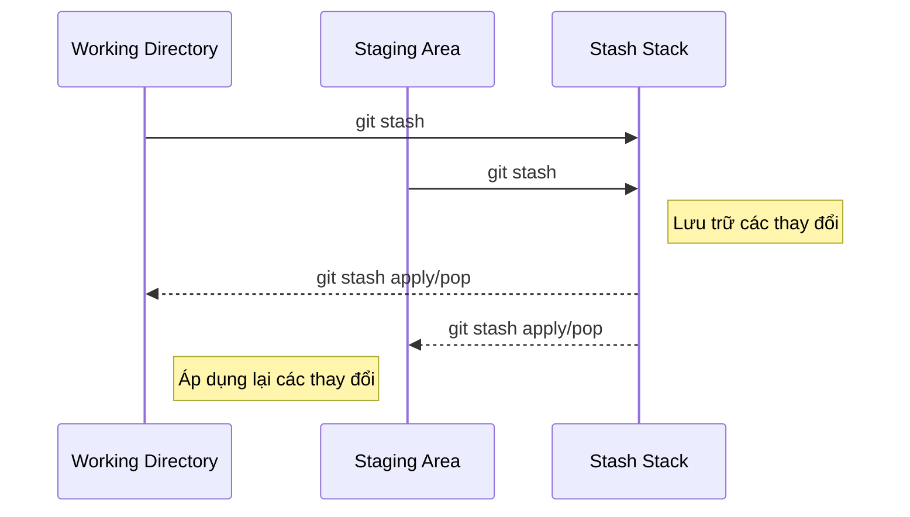

## Git Stash

- Trong quá trình phát triển dự án, có những lúc bạn đang làm việc trên một tính năng mới nhưng cần chuyển đổi sang một nhánh khác hoặc cập nhật mã nguồn từ xa. Tuy nhiên, các thay đổi hiện tại của bạn chưa sẵn sàng để commit. Trong trường hợp này, git stash là một công cụ hữu ích giúp bạn lưu trữ tạm thời các thay đổi chưa được commit, để bạn có thể làm việc khác mà không mất đi công việc đang làm.

### Git stash là gì?

- **git stash** cho phép bạn lưu trữ tạm thời trạng thái hiện tại của **Working Directory** và **Staging Area**, và khôi phục lại trạng thái sạch như sau lần commit cuối cùng. Các thay đổi được lưu trữ trong một ngăn xếp (stack) gọi là stash stack, và bạn có thể áp dụng lại chúng sau này.

> Working Directory: là gì?

> Staging Area: là gì?

### Nguyên lý hoạt động

- Giải thích sơ đồ:

  - Khi bạn thực hiện git stash, các thay đổi từ Working Directory và Staging Area được lưu vào Stash Stack.

  - Khi áp dụng stash, các thay đổi được lấy từ Stash Stack và áp dụng trở lại Working Directory và Staging Area.

### Cách sử dụng git stash

- Các Lệnh `git stash` thường dùng

| Lệnh                                  | Chức năng                                           |
|---------------------------------------|-----------------------------------------------------|
| `git stash`                           | Lưu trữ các thay đổi hiện tại                       |
| `git stash save "Thông điệp"`         | Lưu trữ với thông điệp                              |
| `git stash -u`                        | Lưu trữ bao gồm untracked files                     |
| `git stash list`                      | Hiển thị danh sách các stash                        |
| `git stash apply [stash@{n}]`         | Áp dụng stash mà không xóa khỏi stash stack         |
| `git stash pop [stash@{n}]`           | Áp dụng stash và xóa khỏi stash stack               |
| `git stash drop [stash@{n}]`          | Xóa một stash cụ thể khỏi stash stack               |
| `git stash clear`                     | Xóa tất cả các stash                                |
| `git stash branch [tên_nhánh]`        | Tạo nhánh mới từ stash                              |
