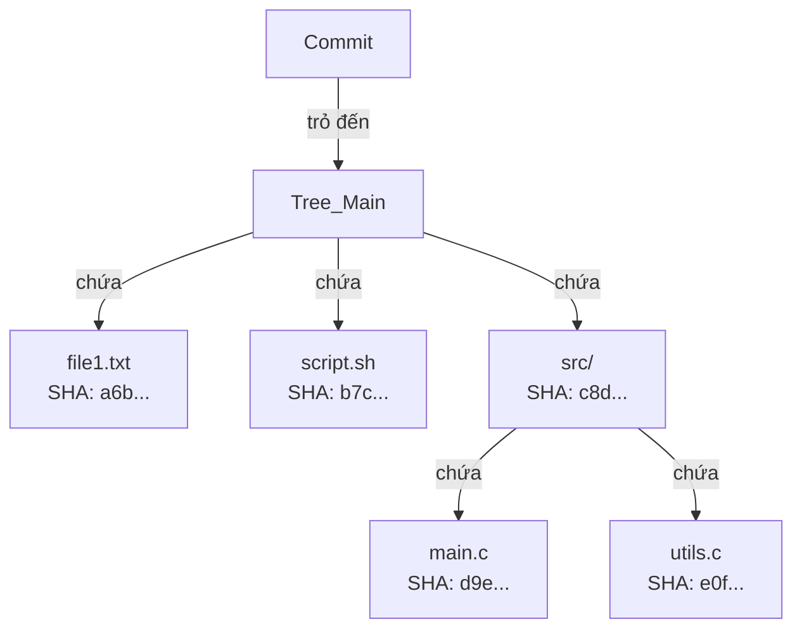

### Git Tree



- Đối tượng Tree đại diện cho cấu trúc thư mục tại một thời điểm cụ thể.
- Nó chứa danh sách các mục (entries), mỗi mục bao gồm:
- Chế độ (mode): Quyền truy cập (ví dụ: 100644 cho tệp thông thường, 100755 cho tệp thực thi, 040000 cho thư mục).
- Loại đối tượng: blob cho tệp, tree cho thư mục con.
- Mã băm SHA-1 của đối tượng con (blob hoặc tree).
- Tên tệp hoặc thư mục.

### Lưu trữ đối tượng Tree

- Khi bạn thực hiện một hành động như commit, Git sẽ tạo ra các đối tượng blob cho nội dung tệp, sau đó tạo đối tượng tree để đại diện cho cấu trúc thư mục.
- Đối tượng tree được nén và lưu trữ dưới dạng tệp nhị phân trong thư mục `.git/objects`.

### Nội dung của một đối tượng Tree

- Bạn có thể xem nội dung của một đối tượng tree bằng lệnh:

```command
git cat-file -p <mã_băm_tree>
```

- Kết quả sẽ hiển thị các mục trong tree đó, ví dụ:

```text
100644 blob a6b...    file1.txt
100755 blob b7c...    script.sh
040000 tree c8d...    src
```

Nội dung hiển thị trên màn hình cho thấy tree chứa hai tệp (file1.txt, script.sh) và một thư mục con (src).

### Vai trò của đối tượng Tree trong Git

- Đối tượng tree cho phép Git theo dõi cấu trúc thư mục và tệp trong kho mã nguồn tại mỗi commit.
- Mỗi commit sẽ tham chiếu đến một đối tượng tree, đại diện cho trạng thái của toàn bộ dự án tại thời điểm đó.
